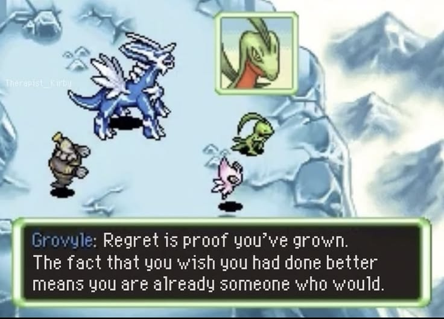

## hi, i'm trishana :)
i <3 solving problems w/ code

- 📊 strong experience with fullstack, ai automation, ml/data, and devops (thank u rbc!)
- 🌱 currently learning: system design, regression, leetcoding (ㅠ﹏ㅠ) 
- 🎨 hobbies: baking, watercolour, drawing, badminton, fitness, gaming (run val?)

## currently working on

- 🏋️‍♀️ fit bestie  
  → fitness app to help noobs at the gym (like me) structure their routine    
  → tech: next.js/typescript, tailwind css, prisma/supabase, react native 🔜

- 👩 personal website  
  → _desperately need to start this..._

## some of my projects!

- 🎓 scholarship matching ai  
  → built the backend for a recommendation system to match students with scholarships  
  → tech: python, django, mysql

- 🎶 air theremin / dj looper hand tracker  
  → real-time gesture-controlled audio system using computer vision to modulate sound and trigger beats  
  → tech: python, opencv, computer vision, audio processing

- 🌱 planetze eco tracker  
  → android app that tracks carbon emissions based on user habits  
  → tech: java, firebase, android studio

- 📈 stock volatility analysis  
  → time series forecasting using historical yfinance tickers, compared ARIMA, GARCH, LSTM models  
  → tech: python, pytorch, numpy

## connect with me! >0<
- linkedin (checked infrequently for my own sanity): www.linkedin.com/in/trishana-rammohan
- email: trishana.rammohan@mail.utoronto.ca

## words of wisdom from grovyle in mystery dungeons

